```r
# set up =======================================================================

library(here)
library(readr)
library(dplyr)
library(ggplot2)
library(sf)

options(readr.show_col_types = FALSE)
options(dplyr.warnings = FALSE)

# read in the functions files
source(here::here("./R/00_global_funs.R"))
source(here::here("./R/01_plots_functions.R"))

fish_data <- readr::read_csv(
    here::here("./data/bati_fish_data_2023-10-04.csv")
) %>%
    standardize_names()
seaway_data <- readr::read_csv(
    here::here("./data/bati_seaway_distances_to_farms.csv")
)
```

```
## New names:
## • `` -> `...1`
```

```r
site_data <- readr::read_csv(here::here("./data/bati_site_data_2023-10-04.csv"))
farm_activity <- readxl::read_xlsx(here::here("./data/farm_activity.xlsx"))
geo_data <- sf::read_sf(here::here("./data/geo-spatial/shapefile/"))
farm_locs <- readr::read_csv(
    here::here("./data/geo-spatial/farm-locations.csv")
)
sampling_locs <- readr::read_csv(
    here::here("./data/geo-spatial/bati_site_master_list.csv")
)
head_dists <- readr::read_csv(
    here::here("./data/headwater-distances.csv")
)
inventory <- readr::read_csv(
    here::here("./data/old-farm-data.csv")
) %>% dplyr::mutate(
    date = lubridate::ym(
        paste(year, month, sep = "-")
    )
)

# some data cleaning ===========================================================
fish_data <- lice_data_clean(fish_data, sampling_locs)

inventory <- inventory[which(inventory$month %in% c(3:6)), ]

# put some initial plots =======================================================
plot_study_area(
    geo_data, farm_locs, sampling_locs,
    to_save = TRUE
)
```

```
## Warning: attribute variables are assumed to be spatially constant throughout
## all geometries
```

```
## Saving 7 x 7 in image
## Saving 7 x 7 in image
```

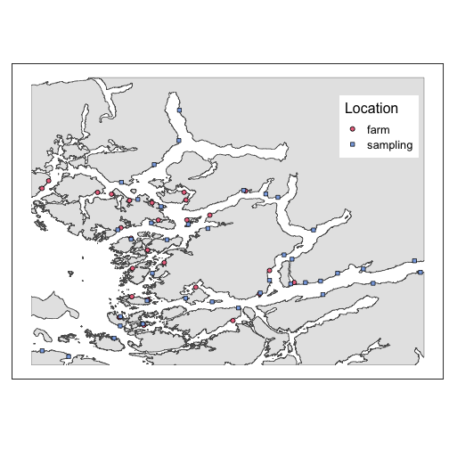

```r
time_series_lice(
    fish_data, sampling_locs, inventory
)
```

```
## `summarise()` has grouped output by 'year', 'month'. You can override using the `.groups` argument.
## Saving 7 x 7 in image
```

```
## Warning: Removed 5 rows containing missing values (`geom_point()`).
```

```
## `summarise()` has grouped output by 'year'. You can override using the `.groups` argument.
## Saving 7 x 7 in image
## `summarise()` has grouped output by 'year', 'month'. You can override using the `.groups` argument.
## Saving 7 x 7 in image
```

```
## Warning: Removed 5 rows containing missing values (`geom_point()`).
```

```
## `summarise()` has grouped output by 'year'. You can override using the `.groups` argument.
## Saving 7 x 7 in image
## `summarise()` has grouped output by 'year'. You can override using the `.groups` argument.
## Saving 7 x 7 in image
```

```
## Warning: Removed 2 rows containing non-finite values (`stat_smooth()`).
```

```
## Warning: Removed 2 rows containing missing values (`geom_point()`).
```

```
## Saving 7 x 7 in image
## `summarise()` has grouped output by 'year', 'month'. You can override using the `.groups` argument.
## `summarise()` has grouped output by 'year'. You can override using the `.groups` argument.
## `summarise()` has grouped output by 'year'. You can override using the `.groups` argument.
## Saving 7 x 7 in image
```

```
## Warning: Removed 1 rows containing non-finite values (`stat_smooth()`).
```

```
## Warning: Removed 1 rows containing missing values (`geom_point()`).
```

```
## Saving 7 x 7 in image
```

```
## Warning: Removed 1 rows containing non-finite values (`stat_smooth()`).
## Removed 1 rows containing missing values (`geom_point()`).
```

```
## [[1]]
```

```
## Warning: Removed 5 rows containing missing values (`geom_point()`).
```

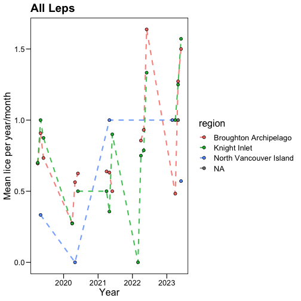

```
## 
## [[2]]
```

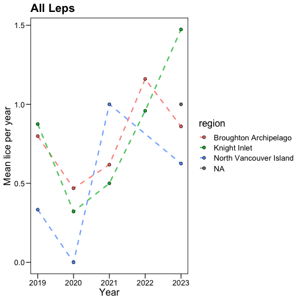

```
## 
## [[3]]
```

```
## Warning: Removed 5 rows containing missing values (`geom_point()`).
```

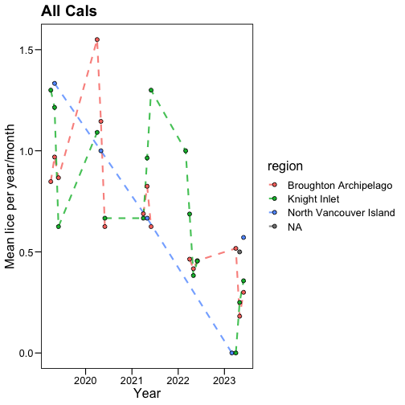

```
## 
## [[4]]
```

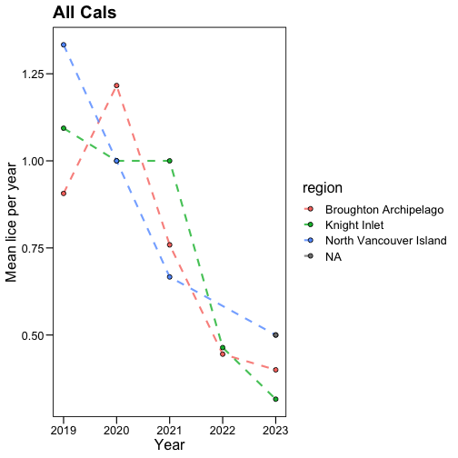

```
## 
## [[5]]
```

```
## Warning: Removed 2 rows containing non-finite values (`stat_smooth()`).
```

```
## Warning: Removed 2 rows containing missing values (`geom_point()`).
```

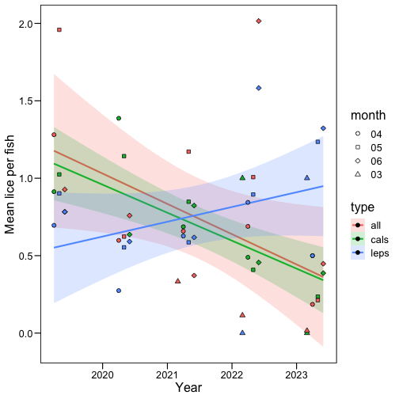

```
## 
## [[6]]
```

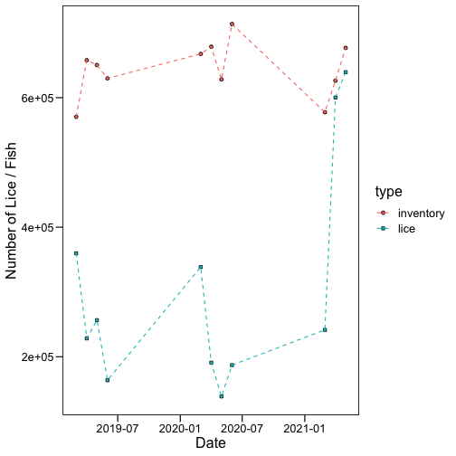

```
## 
## [[7]]
```

```
## Warning: Removed 1 rows containing non-finite values (`stat_smooth()`).
```

```
## Warning: Removed 1 rows containing missing values (`geom_point()`).
```

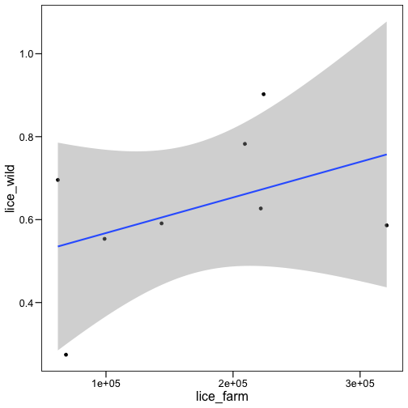

```
## 
## [[8]]
```

```
## Warning: Removed 1 rows containing non-finite values (`stat_smooth()`).
## Removed 1 rows containing missing values (`geom_point()`).
```

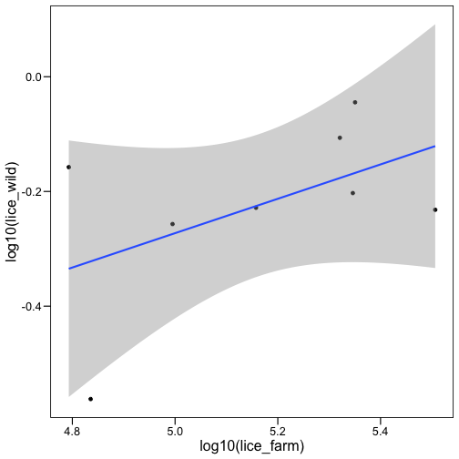

```r
maps_with_data(
    inventory, fish_data, sampling_locs, farm_locs, geo_data
)
```

```
## `summarise()` has grouped output by 'year'. You can override using the
## `.groups` argument.
```

```
## Warning: attribute variables are assumed to be spatially constant throughout
## all geometries
```

```
## Saving 7 x 7 in image
## Saving 7 x 7 in image
## Saving 7 x 7 in image
## `summarise()` has grouped output by 'site_code'. You can override using the `.groups` argument.
## Saving 7 x 7 in image
```

```
## Warning: Removed 10 rows containing missing values (`geom_sf()`)
```

```
## Saving 7 x 7 in image
```

```
## Warning: Removed 10 rows containing missing values (`geom_sf()`)
```

```
## Saving 7 x 7 in image
## Saving 7 x 7 in image
## Saving 7 x 7 in image
## Saving 7 x 7 in image
## Saving 7 x 7 in image
## Saving 7 x 7 in image
```

```
## Warning: Removed 10 rows containing missing values (`geom_sf()`)
```

```
## Saving 7 x 7 in image
```

```
## Warning: Removed 10 rows containing missing values (`geom_sf()`)
```

```
## Saving 7 x 7 in image
```

```
## Warning: Removed 10 rows containing missing values (`geom_sf()`)
```

```
## Saving 7 x 7 in image
## Saving 7 x 7 in image
## Saving 7 x 7 in image
## Saving 7 x 7 in image
## Saving 7 x 7 in image
## Saving 7 x 7 in image
```

```
## Warning: Removed 10 rows containing missing values (`geom_sf()`)
```

```
## Saving 7 x 7 in image
```

```
## Warning: Removed 10 rows containing missing values (`geom_sf()`)
```

```
## Saving 7 x 7 in image
```

```
## Warning: Removed 10 rows containing missing values (`geom_sf()`)
```

```
## Saving 7 x 7 in image
## Saving 7 x 7 in image
## Saving 7 x 7 in image
## Saving 7 x 7 in image
## Saving 7 x 7 in image
## Saving 7 x 7 in image
```

```
## Warning: Removed 10 rows containing missing values (`geom_sf()`)
```

```
## Saving 7 x 7 in image
```

```
## Warning: Removed 9 rows containing missing values (`geom_sf()`)
```

```
## Saving 7 x 7 in image
```

```
## Warning: Removed 9 rows containing missing values (`geom_sf()`)
```

```
## Saving 7 x 7 in image
## Saving 7 x 7 in image
## Saving 7 x 7 in image
## Saving 7 x 7 in image
## Saving 7 x 7 in image
## Saving 7 x 7 in image
```

```
## Warning: Removed 9 rows containing missing values (`geom_sf()`)
```

```
## Saving 7 x 7 in image
```

```
## Warning: Removed 13 rows containing missing values (`geom_sf()`)
```

```
## Saving 7 x 7 in image
```

```
## Warning: Removed 13 rows containing missing values (`geom_sf()`)
```

```
## Saving 7 x 7 in image
## Saving 7 x 7 in image
## Saving 7 x 7 in image
## Saving 7 x 7 in image
## Saving 7 x 7 in image
## Saving 7 x 7 in image
```

```
## Warning: Removed 13 rows containing missing values (`geom_sf()`)
```

```
## $length
```

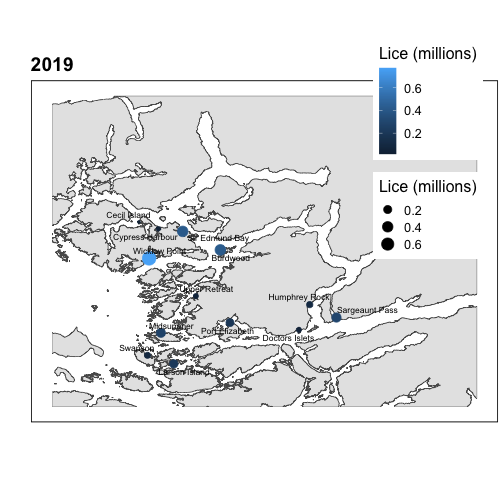

```
## 
## [[2]]
```

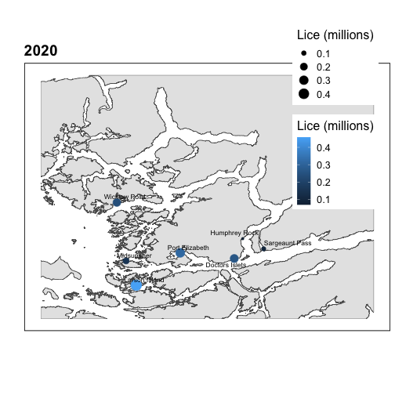

```
## 
## [[3]]
```

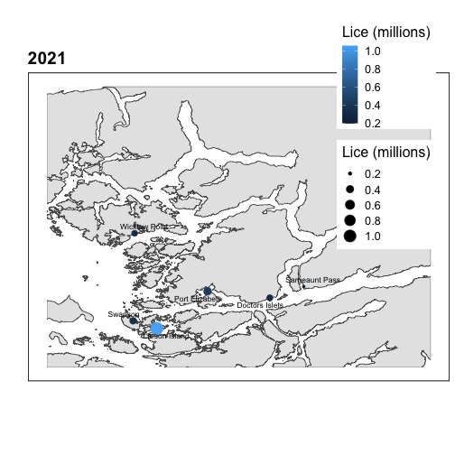

```
## 
## [[4]]
```

```
## Warning: Removed 10 rows containing missing values (`geom_sf()`)
```

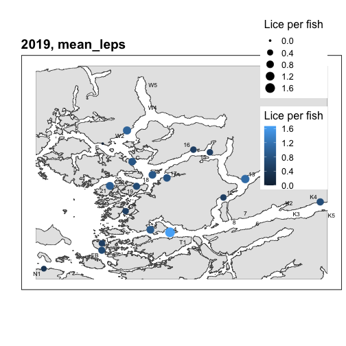

```
## 
## [[5]]
```

```
## Warning: Removed 10 rows containing missing values (`geom_sf()`)
```

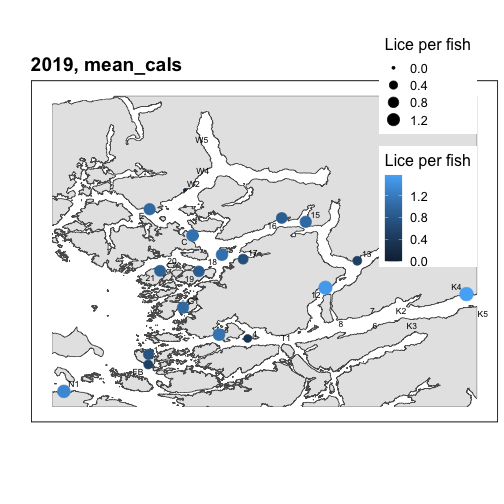

```
## 
## [[6]]
```

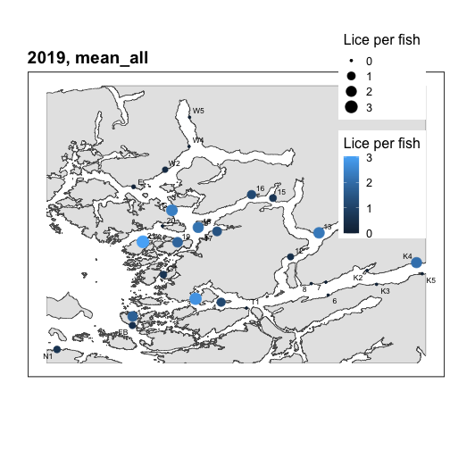

```
## 
## [[7]]
```

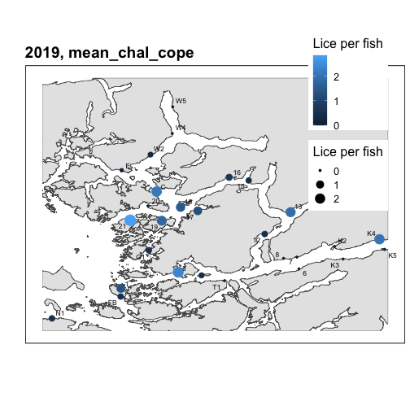

```
## 
## [[8]]
```

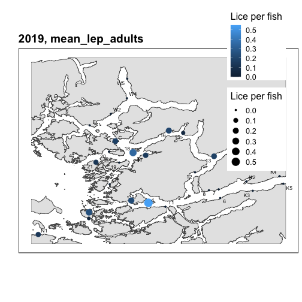

```
## 
## [[9]]
```


```
## 
## [[10]]
```

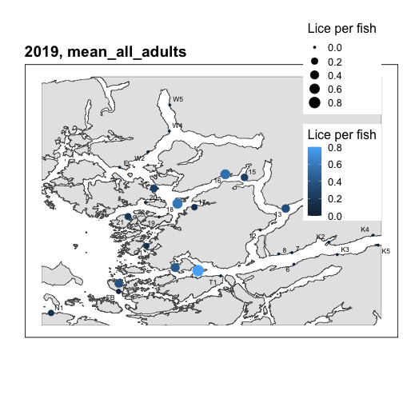

```
## 
## [[11]]
```

```
## Warning: Removed 10 rows containing missing values (`geom_sf()`)
```

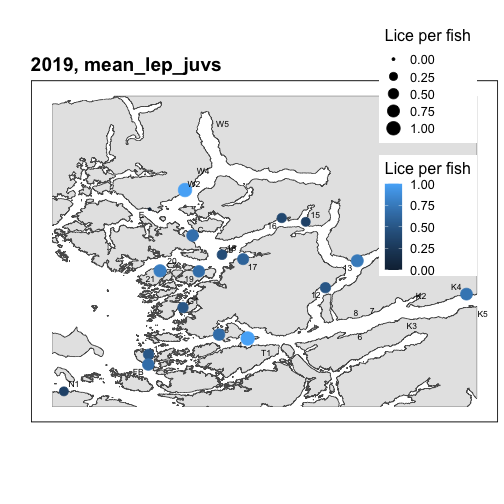

```
## 
## [[12]]
```

```
## Warning: Removed 10 rows containing missing values (`geom_sf()`)
```

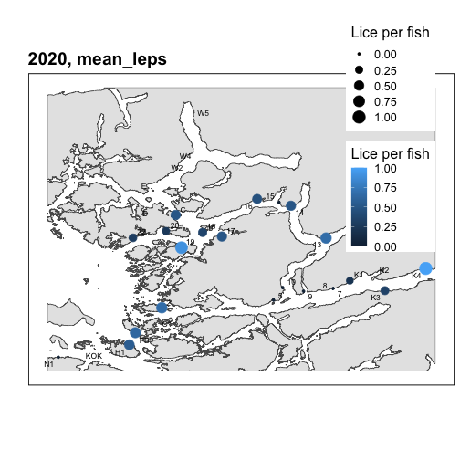

```
## 
## [[13]]
```

```
## Warning: Removed 10 rows containing missing values (`geom_sf()`)
```

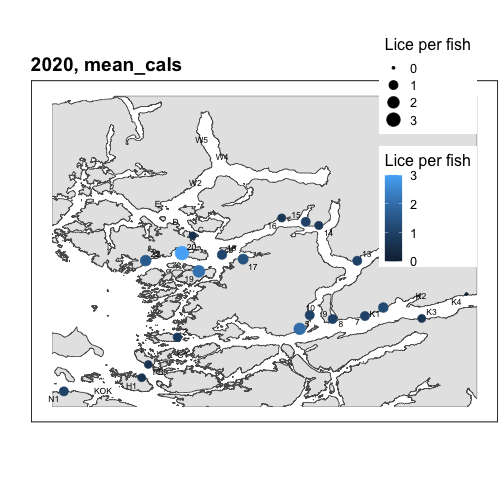

```
## 
## [[14]]
```

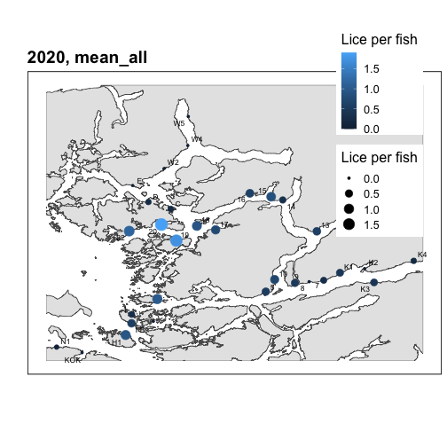

```
## 
## [[15]]
```

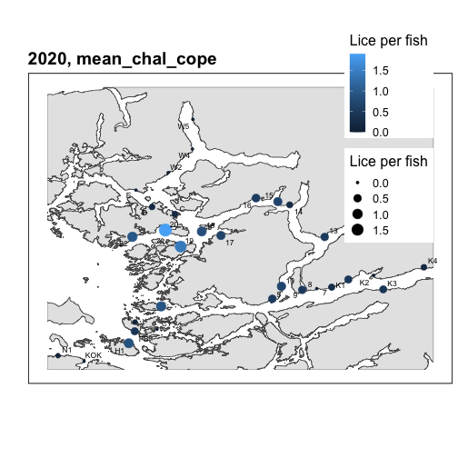

```
## 
## [[16]]
```

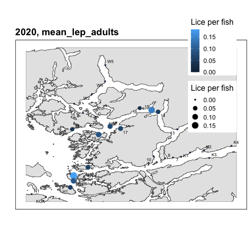

```
## 
## [[17]]
```

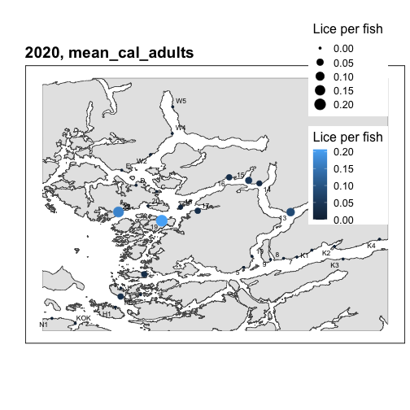

```
## 
## [[18]]
```

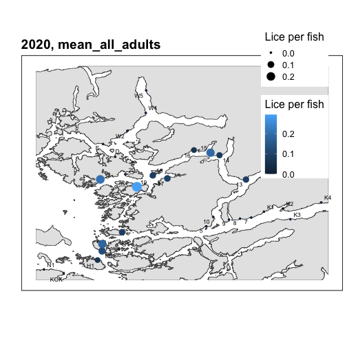

```
## 
## [[19]]
```

```
## Warning: Removed 10 rows containing missing values (`geom_sf()`)
```


```
## 
## [[20]]
```

```
## Warning: Removed 10 rows containing missing values (`geom_sf()`)
```


```
## 
## [[21]]
```

```
## Warning: Removed 10 rows containing missing values (`geom_sf()`)
```

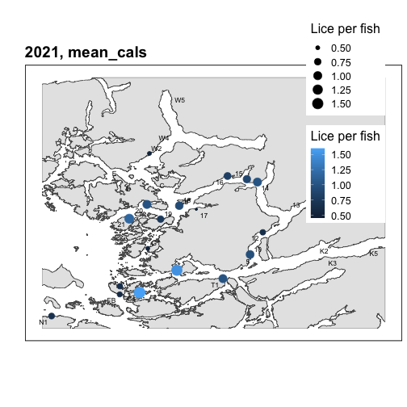

```
## 
## [[22]]
```

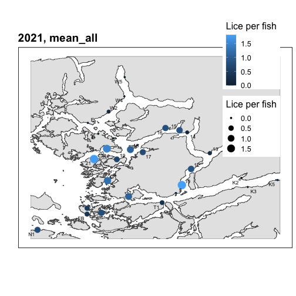

```
## 
## [[23]]
```


```
## 
## [[24]]
```

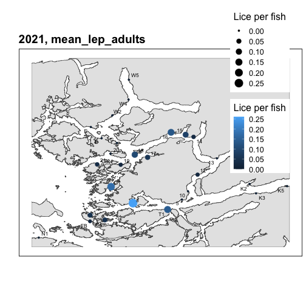

```
## 
## [[25]]
```

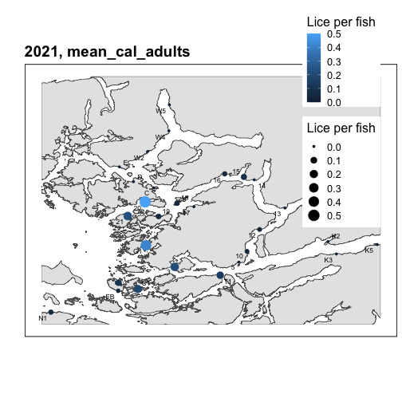

```
## 
## [[26]]
```

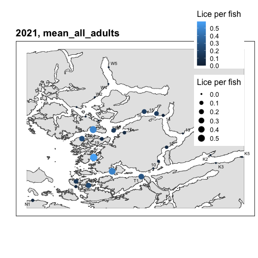

```
## 
## [[27]]
```

```
## Warning: Removed 10 rows containing missing values (`geom_sf()`)
```


```
## 
## [[28]]
```

```
## Warning: Removed 9 rows containing missing values (`geom_sf()`)
```

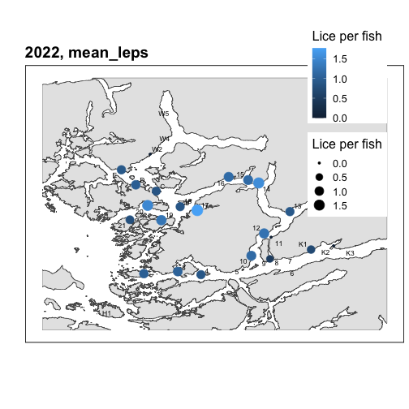

```
## 
## [[29]]
```

```
## Warning: Removed 9 rows containing missing values (`geom_sf()`)
```

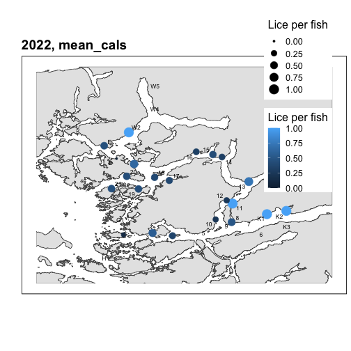

```
## 
## [[30]]
```

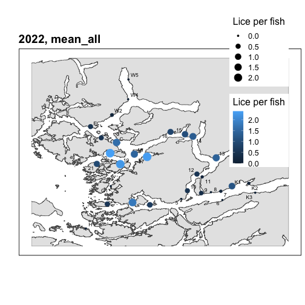

```
## 
## [[31]]
```

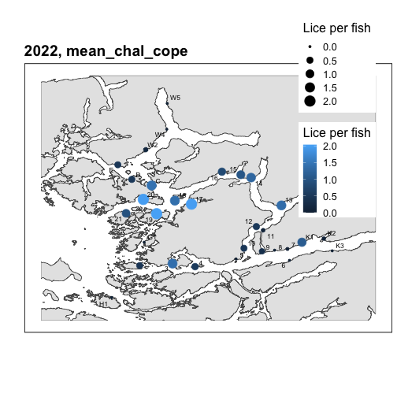

```
## 
## [[32]]
```

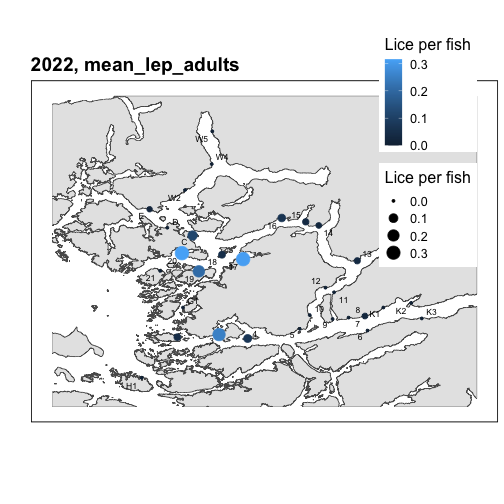

```
## 
## [[33]]
```

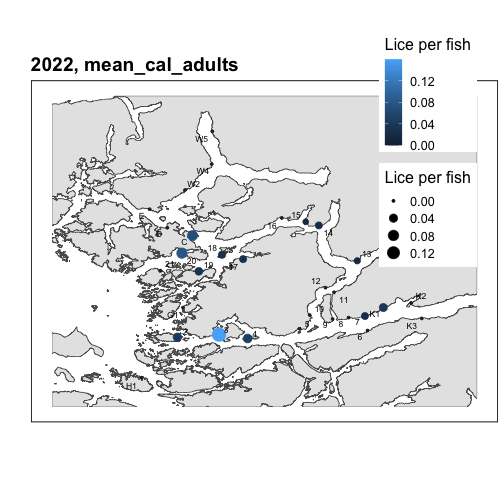

```
## 
## [[34]]
```

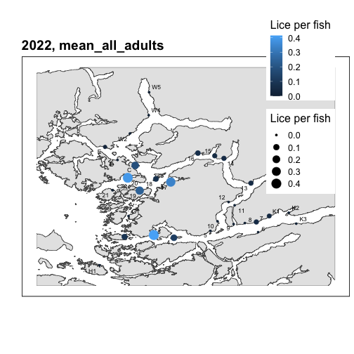

```
## 
## [[35]]
```

```
## Warning: Removed 9 rows containing missing values (`geom_sf()`)
```

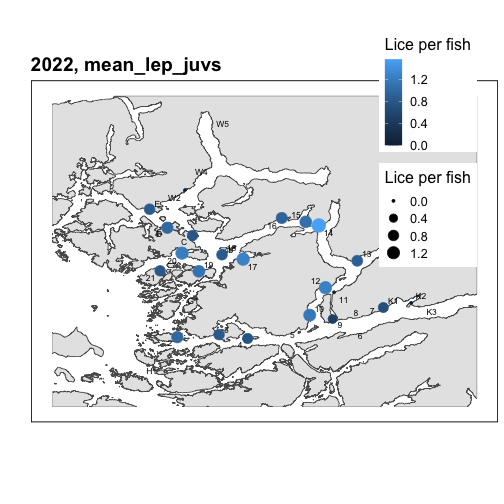

```
## 
## [[36]]
```

```
## Warning: Removed 13 rows containing missing values (`geom_sf()`)
```

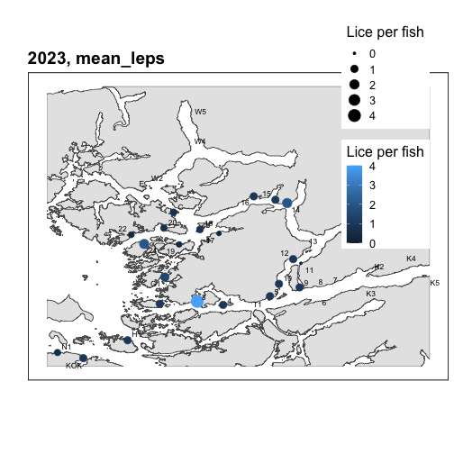

```
## 
## [[37]]
```

```
## Warning: Removed 13 rows containing missing values (`geom_sf()`)
```

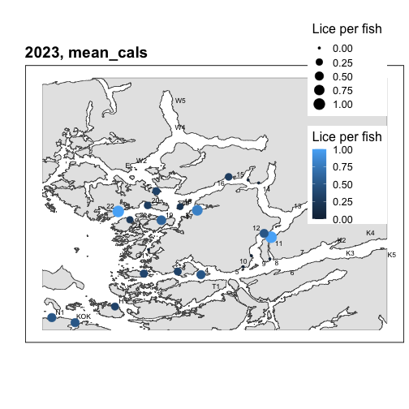

```
## 
## [[38]]
```

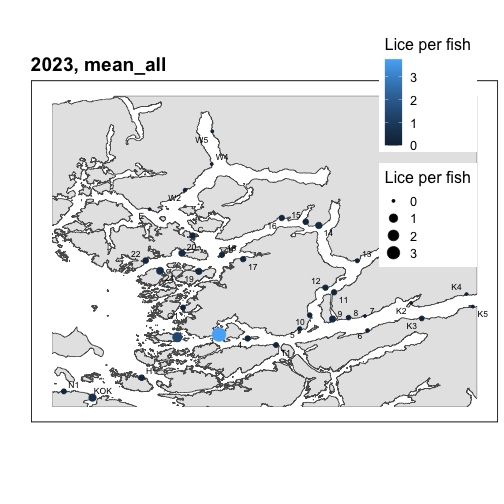

```
## 
## [[39]]
```

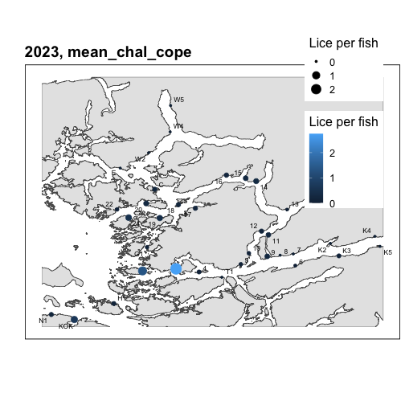

```
## 
## [[40]]
```

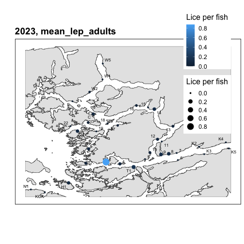

```
## 
## [[41]]
```

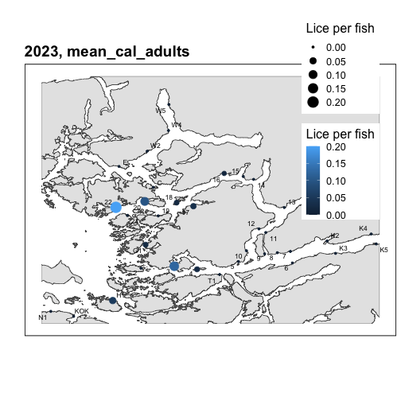

```
## 
## [[42]]
```

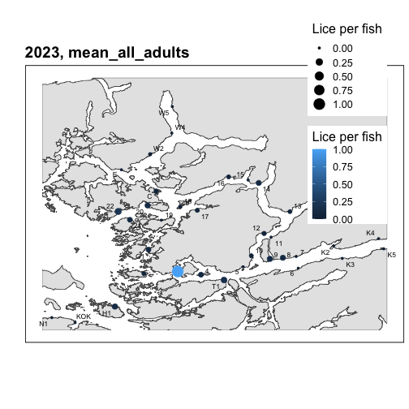

```
## 
## [[43]]
```

```
## Warning: Removed 13 rows containing missing values (`geom_sf()`)
```

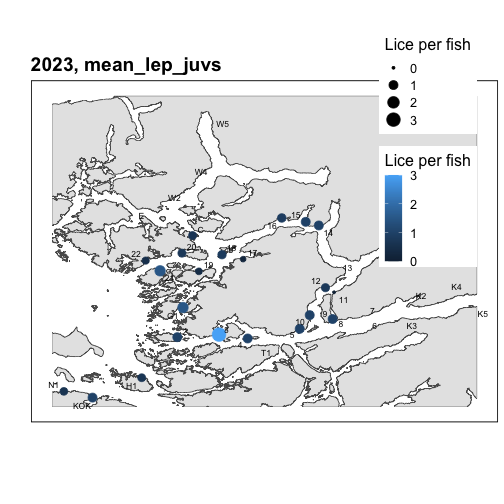

```r
headwater_distances(
    head_dists, fish_data
)
```

```
## Saving 7 x 7 in image
```

```
## Warning: Removed 6 rows containing missing values (`position_stack()`).
```

```
## Warning: Removed 36 rows containing missing values (`geom_point()`).
```

```
## Saving 7 x 7 in image
```

```
## Warning: Removed 6 rows containing missing values (`position_stack()`).
## Removed 36 rows containing missing values (`geom_point()`).
```

```
## Saving 7 x 7 in image
```

```
## Warning: Removed 6 rows containing missing values (`position_stack()`).
## Removed 36 rows containing missing values (`geom_point()`).
```

```
## Saving 7 x 7 in image
```

```
## Warning: Removed 6 rows containing missing values (`position_stack()`).
```

```
## Warning: Removed 39 rows containing missing values (`geom_point()`).
```

```
## Saving 7 x 7 in image
```

```
## Warning: Removed 7 rows containing missing values (`position_stack()`).
```

```
## Warning: Removed 30 rows containing missing values (`geom_point()`).
```

```
## Saving 7 x 7 in image
```

```
## Warning: Removed 7 rows containing missing values (`position_stack()`).
## Removed 30 rows containing missing values (`geom_point()`).
```

```
## Saving 7 x 7 in image
```

```
## Warning: Removed 7 rows containing missing values (`position_stack()`).
## Removed 30 rows containing missing values (`geom_point()`).
```

```
## Saving 7 x 7 in image
```

```
## Warning: Removed 7 rows containing missing values (`position_stack()`).
```

```
## Warning: Removed 33 rows containing missing values (`geom_point()`).
```

```
## Saving 7 x 7 in image
```

```
## Warning: Removed 11 rows containing missing values (`position_stack()`).
```

```
## Warning: Removed 42 rows containing missing values (`geom_point()`).
```

```
## Saving 7 x 7 in image
```

```
## Warning: Removed 11 rows containing missing values (`position_stack()`).
## Removed 42 rows containing missing values (`geom_point()`).
```

```
## Saving 7 x 7 in image
```

```
## Warning: Removed 11 rows containing missing values (`position_stack()`).
## Removed 42 rows containing missing values (`geom_point()`).
```

```
## Saving 7 x 7 in image
```

```
## Warning: Removed 11 rows containing missing values (`position_stack()`).
```

```
## Warning: Removed 44 rows containing missing values (`geom_point()`).
```

```
## [[1]]
```

```
## Warning: Removed 6 rows containing missing values (`position_stack()`).
```

```
## Warning: Removed 36 rows containing missing values (`geom_point()`).
```

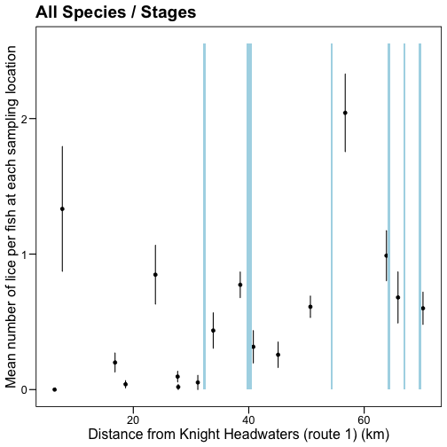

```
## 
## [[2]]
```

```
## Warning: Removed 6 rows containing missing values (`position_stack()`).
## Removed 36 rows containing missing values (`geom_point()`).
```

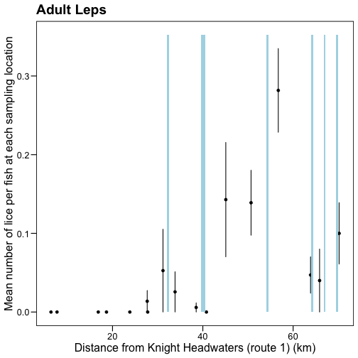

```
## 
## [[3]]
```

```
## Warning: Removed 6 rows containing missing values (`position_stack()`).
```

```
## Warning: Removed 39 rows containing missing values (`geom_point()`).
```

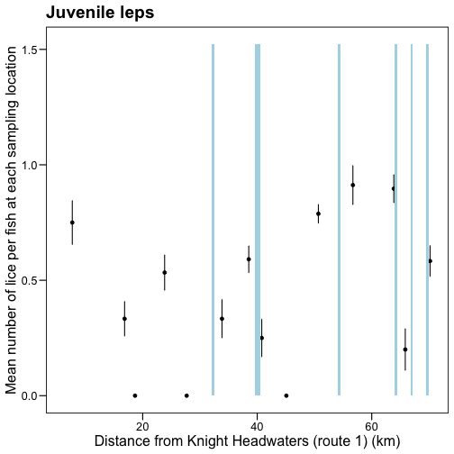

```
## 
## [[4]]
```

```
## Warning: Removed 6 rows containing missing values (`position_stack()`).
```

```
## Warning: Removed 36 rows containing missing values (`geom_point()`).
```

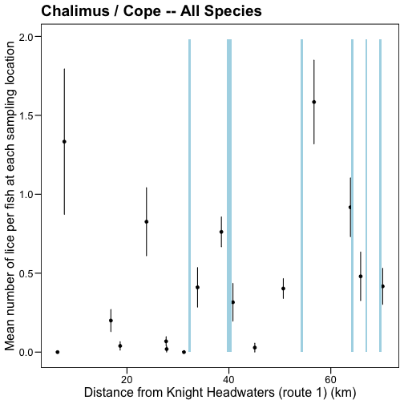

```
## 
## [[5]]
```

```
## Warning: Removed 7 rows containing missing values (`position_stack()`).
```

```
## Warning: Removed 30 rows containing missing values (`geom_point()`).
```

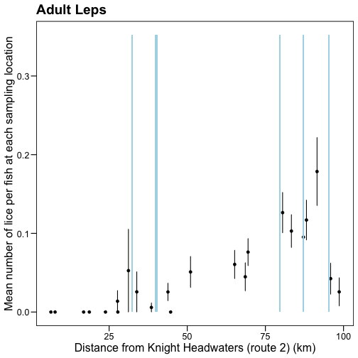

```
## 
## [[6]]
```

```
## Warning: Removed 7 rows containing missing values (`position_stack()`).
## Removed 30 rows containing missing values (`geom_point()`).
```

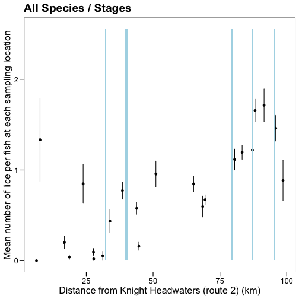

```
## 
## [[7]]
```

```
## Warning: Removed 7 rows containing missing values (`position_stack()`).
```

```
## Warning: Removed 33 rows containing missing values (`geom_point()`).
```

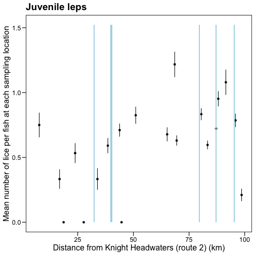

```
## 
## [[8]]
```

```
## Warning: Removed 7 rows containing missing values (`position_stack()`).
```

```
## Warning: Removed 30 rows containing missing values (`geom_point()`).
```

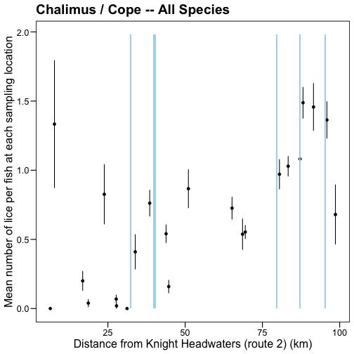

```
## 
## [[9]]
```

```
## Warning: Removed 11 rows containing missing values (`position_stack()`).
```

```
## Warning: Removed 42 rows containing missing values (`geom_point()`).
```

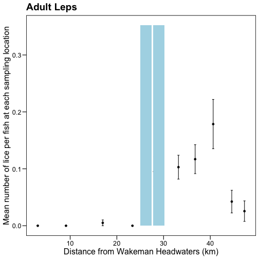

```
## 
## [[10]]
```

```
## Warning: Removed 11 rows containing missing values (`position_stack()`).
## Removed 42 rows containing missing values (`geom_point()`).
```

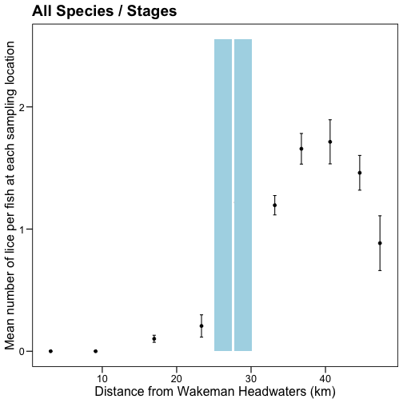

```
## 
## [[11]]
```

```
## Warning: Removed 11 rows containing missing values (`position_stack()`).
```

```
## Warning: Removed 44 rows containing missing values (`geom_point()`).
```

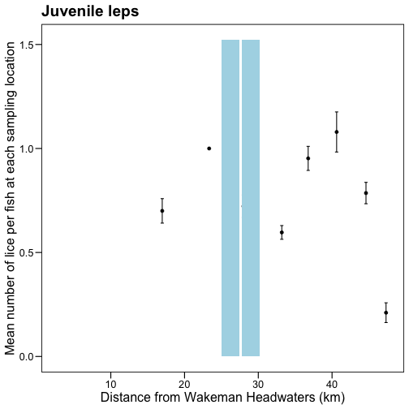

```
## 
## [[12]]
```

```
## Warning: Removed 11 rows containing missing values (`position_stack()`).
```

```
## Warning: Removed 42 rows containing missing values (`geom_point()`).
```

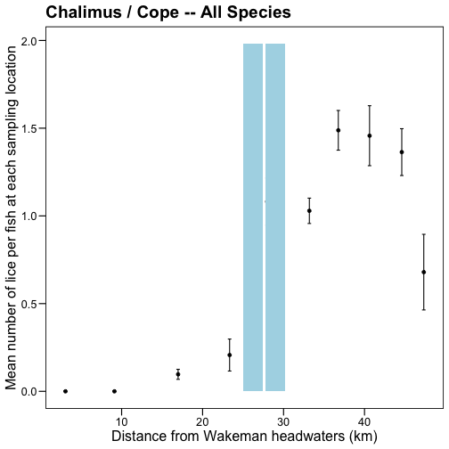

